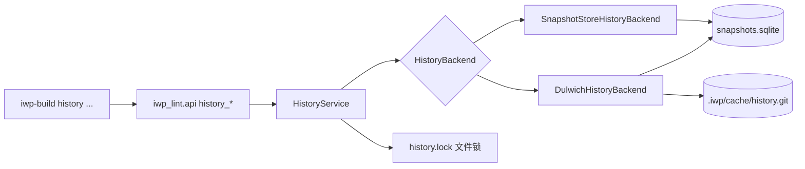
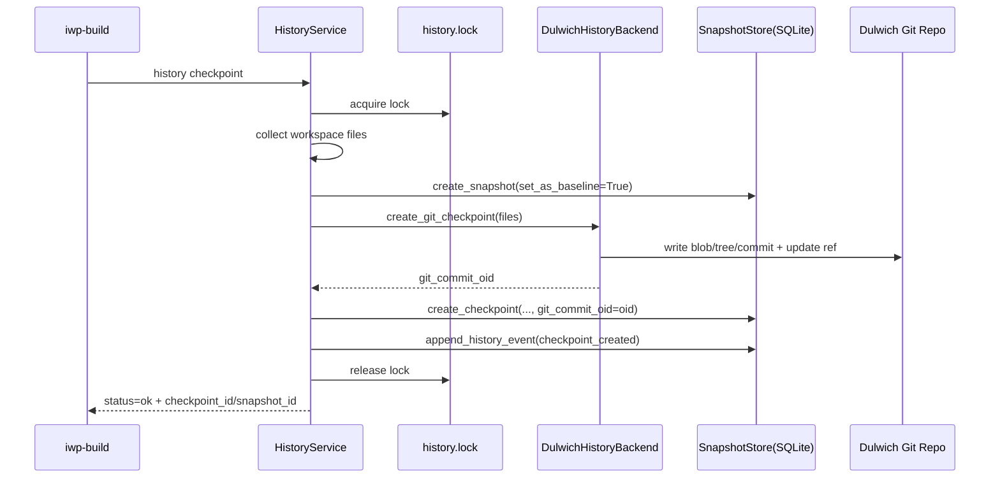
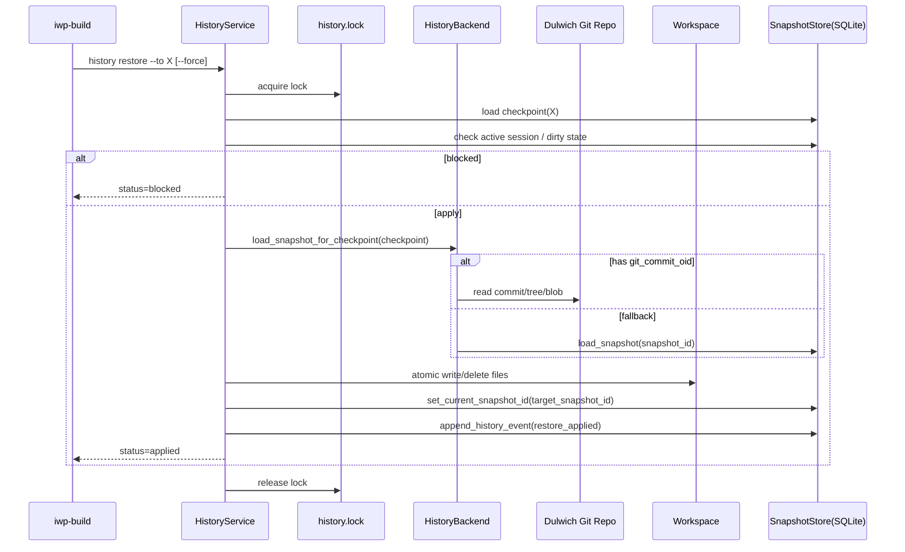

# 快照系统架构总结（改造后）

## 1. 背景与目标

本次改造后的 `history checkpoint / restore` 系统，核心目标是：

1. 保持现有 CLI 契约与 session gate 语义不变  
2. 将快照读写能力升级为 **Git 对象存储 + SQLite 索引元数据** 的双层架构  
3. 在 restore 路径上优先使用 Git commit 内容作为恢复源，提升数据可靠性  
4. 增加并发互斥，避免 checkpoint / restore / prune 相互踩踏

---

## 2. 总体架构

### 2.1 分层职责

- **命令层（iwp_build）**：参数解析、命令路由、JSON 输出
- **服务层（HistoryService）**：checkpoint/restore/prune 语义编排、阻断规则、并发锁
- **后端层（HistoryBackend）**：快照存储实现
  - `SnapshotStoreHistoryBackend`：纯 SQLite 快照实现（兼容/回退）
  - `DulwichHistoryBackend`：checkpoint 写 Git commit，restore 从 Git commit 读快照
- **数据层**：
  - SQLite：checkpoint/snapshot/session 元数据索引
  - Git：内容寻址对象库（blob/tree/commit）

---

## 3. 数据模型与关键字段

## 3.1 SQLite checkpoints 表

改造后新增字段：

- `git_commit_oid TEXT`

用途：

- 将 checkpoint 记录与 Git commit 绑定
- restore 时优先通过 `git_commit_oid` 读取对应 commit tree

兼容策略：

- 启动时检测 `checkpoints` 表结构
- 若旧库无 `git_commit_oid`，自动执行 `ALTER TABLE ... ADD COLUMN`

---

## 4. 核心时序

## 4.1 checkpoint 主流程

### 4.1.1 关键点

- `snapshot_id` 仍保留，保证现有统计与回退路径兼容
- `git_commit_oid` 成为高可靠内容源锚点
- CLI 输出契约保持不变，仅新增可观测字段

## 4.2 restore 主流程

### 4.2.1 关键点

- open session 与 dirty workspace 阻断语义不变
- `--force` 语义不变
- restore 数据源优先级：
  1. `git_commit_oid` 对应 commit tree
  2. （可选）回退到 SQLite `snapshot_id`（受 `history.safety.allow_sqlite_fallback` 控制）

---

## 5. 并发与一致性

## 5.1 并发互斥策略

`HistoryService` 在以下操作上统一加锁：

- `checkpoint`
- `restore`
- `prune`

实现方式：

- lock 文件：`${cache_dir}/history.lock`
- OS 文件锁：`msvcrt.locking`（Windows）/`fcntl.flock`（Unix-like）
- 超时重试：短轮询 + 固定超时
- 释放策略：`finally` 中统一 unlock + close；进程异常退出由 OS 自动回收锁

## 5.2 写入一致性

- workspace 文件恢复采用原子写（临时文件 + replace）
- restore 前可自动生成安全 checkpoint（`restore_before_apply`）
- 历史事件全量落库，便于审计与回溯
- prune 阶段执行 `gc v1`：仅清理不可达 loose objects（保守模式，不改 refs/pack）

---

## 6. 配置项

`iwp_lint.config.HistoryConfig` 新增：

- `history.backend`：`dulwich | snapshot`（默认 `dulwich`）
- `history.git_dir`：Git 存储目录（默认 `.iwp/cache/history.git`）

`iwp_lint.config.TrackingScopeConfig`（`tracking.snapshot`）新增：

- `tracking.snapshot.max_file_size_kb`：单文件快照大小上限（默认 `5120`）

这使系统可以在同一语义层做后端切换与回退。

---

## 7. 关键代码文件索引

## 7.1 核心实现

- `iwp_lint/core/history_service.py`
  - `HistoryBackend` 协议
  - `SnapshotStoreHistoryBackend` 与 `DulwichHistoryBackend`
  - `HistoryService`（checkpoint/restore/prune 编排 + 文件锁）

- `iwp_lint/vcs/snapshot_store.py`
  - checkpoint/snapshot/session 元数据持久化
  - `git_commit_oid` 字段与自动 schema 迁移

- `iwp_lint/config.py`
  - `HistoryConfig.backend`
  - `HistoryConfig.git_dir`

## 7.2 API 与 CLI 接入

- `iwp_lint/api.py`
  - `history_checkpoint/history_restore/history_list/history_prune`

- `iwp_build/cli.py`
  - `history checkpoint/restore/list/prune` 命令处理与输出

## 7.3 测试

- `iwp_lint/tests/test_history_service.py`
  - dulwich 读源优先、锁冲突、restore 阻断等核心语义

- `iwp_build/tests/test_history_cli.py`
  - CLI 契约与 `git_commit_oid` 可见性

- `iwp_build/tests/e2e/test_history_restore_flow.py`
  - 多轮 checkpoint/restore 稳定性、rename、UTF-8、open-session 阻断等

---

## 8. 当前语义边界

- `session commit` 仍是 gate 驱动的基线推进语义
- `session commit` / `history checkpoint` / `restore_before_apply` 都会写 Dulwich commit 并记录 `git_commit_oid`
- `history checkpoint` 是开发态快照，不触发 gate
- `history restore` 仍默认受 open session / dirty workspace 保护
- `history restore` 支持严格模式（`history.safety.strict_dulwich_restore=true`），缺失 `git_commit_oid` 的 checkpoint 默认阻断
- `workflow.mode` 只做可观测与 warning，不改变 gate pass/fail

---

## 9. 后续演进建议

1. 在 `prune` 阶段增加 Git 对象可达性与清理策略  
2. 增加异常注入测试（恢复中断、电源中断模拟）  
3. 将锁策略抽象为通用基础设施，复用于 session 关键写路径  
4. 增加一次“长链路随机跳转恢复”压力测试作发布前门禁  
5. 评估 `gc v2`（pack/压缩）以进一步控制对象库碎片
