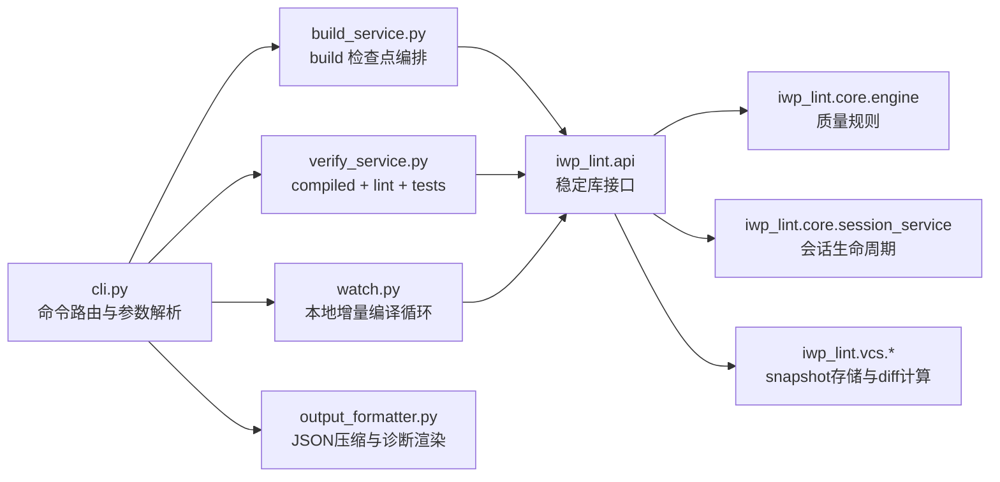
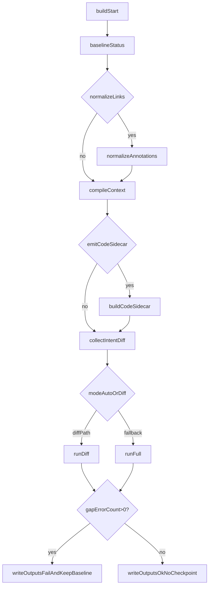
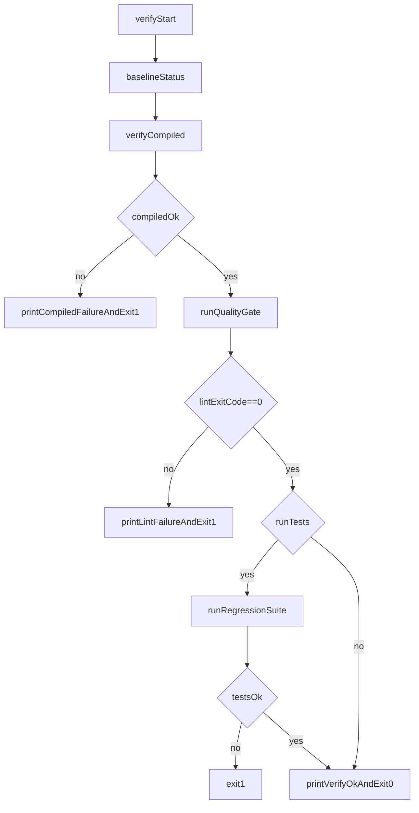
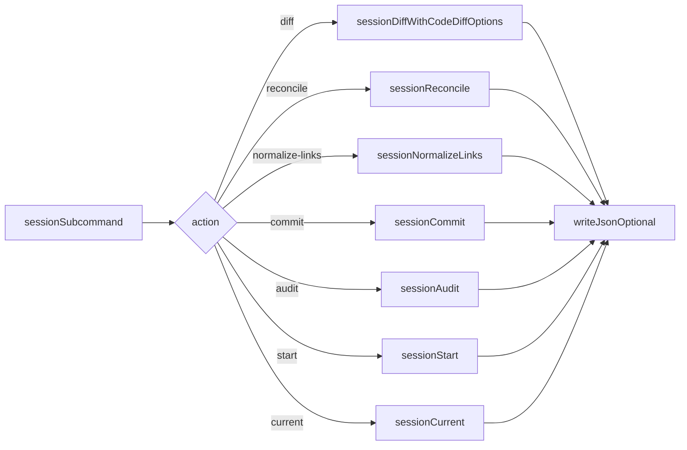
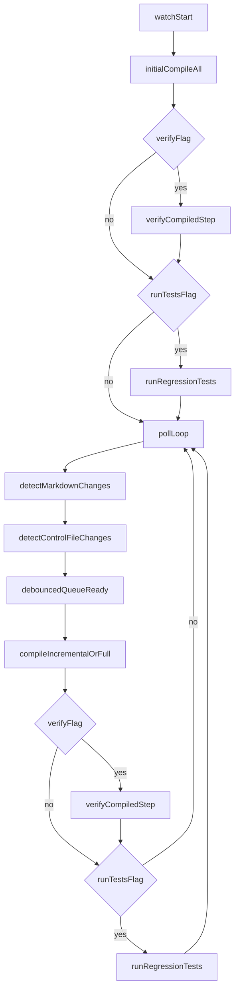

# iwp-build 架构与工作机制说明

本文档面向 `iwp_build` 维护者，说明当前架构边界、关键模块职责、核心数据流与扩展建议。

## 1. 目标与边界

`iwp-build` 是 IWP 的编排层（orchestrator），负责把 `iwp_lint` 的能力组织成可执行工作流。

- 目标：
  - 提供统一入口：`build` / `verify` / `watch` / `session *`
  - 把“编译上下文、意图差异、实现缺口、基线推进”串成检查点流程
  - 输出 agent 可消费 JSON（build full + session reconcile）
- 非目标：
  - 不重复实现 lint/schema/coverage/diff 算法
  - 不替代代码生成器或 agent runtime
  - 不维护独立规则体系（规则来源保持在 `iwp_lint`）

## 2. 模块总览



## 3. 关键文件职责

- `cli.py`
  - 唯一命令入口，负责参数定义、子命令分发、错误提示
  - 统一支持 `--config` 与 session diff 参数透传（`code-diff-level/context/max-chars`）
- `build_service.py`
  - `run_build(...)` 主编排函数
  - 负责 build 只读构建生命周期：
    - baseline 状态读取
    - 可选 `normalize-links`
    - `.iwc` 编译 + code sidecar
    - gap 计算（`run_diff` 或回退 `run_full`）
    - 产出 build full JSON（显式 no-checkpoint）
- `verify_service.py`
  - 负责交付前校验闭环：
    - `verify_compiled`
    - `run_quality_gate`
    - 可选 regression tests
  - 输出失败摘要和修复提示（通过 `output_formatter`）
- `watch.py`
  - 本地开发循环：监听 markdown/control 文件变化，防抖后触发增量编译
  - 支持 `--verify` 与 `--run-tests` 链式执行
- `output_formatter.py`
  - JSON 落盘与控制台摘要输出
  - 通用安全转换（`safe_len/safe_int`）与 remediation hints
- `tests/`
  - `test_build_commit.py`：build 只读语义 + commit 单写 baseline 语义
  - `test_session_cli.py`：session CLI 路径与参数透传
  - `test_watch.py`：watch 的变更检测与防抖行为
  - `test_e2e_suite.py` + `e2e/*`：端到端回归场景

## 4. 核心数据与产物

- 输入：
  - `.iwp-lint.yaml`（含 schema、thresholds、session 参数等）
  - `InstructWare.iw/**/*.md`
  - 代码注释链接 `@iwp.link ...`
- 中间状态：
  - `.iwp/cache/snapshots.sqlite`（baseline + sessions + events）
  - `.iwp/compiled/**`（`.iwc` 编译产物）
- 输出：
  - full payload：`--json`（`summary`、`compile`、`intent_diff`、`gap_report`、`checkpoint`）
  - reconcile payload：`session reconcile --json`（agent 收敛与执行上下文）

## 5. 核心流程

## 5.1 Build 只读流程



关键语义：

- `mode=auto` 优先走 diff；无 baseline 时回退 `bootstrap_full`
- `build` 成功/失败都不推进 baseline（无状态副作用）
- baseline 唯一写入入口为 `session commit`

## 5.2 Verify 交付流程



## 5.3 Session 子命令流程



说明：

- `session diff/reconcile/commit` 在未传 `--session-id` 时会优先回退到 current open session
- `session diff` 支持 `summary/hunk` 两级代码差异输出
- `session start` 支持 `--if-missing` 幂等引导：有活动会话时直接复用
- `session reconcile` 支持可选 `normalize-links`，执行顺序为 `diff -> (optional normalize) -> gate`
- `session reconcile --auto-build-sidecar` 在 sidecar stale 时执行受控刷新（`compile_context + build_code_sidecar`）后继续判定
- `session normalize-links` 提供 session 语义入口，内部委托链接规范化写入

## 5.4 Watch 本地循环流程



## 6. 设计约束与稳定性约定

- 单一真相来源：规则与 diff 语义全部来自 `iwp_lint`，`iwp_build` 只做编排
- baseline 推进约束：仅 `session commit` 可推进
- 人机双消费：
  - 控制台输出用于本地诊断
  - JSON 输出用于 agent/runtime 自动消费

## 7. 推荐扩展点

- 新增 build 子流程：优先放在 `build_service.py`，保持 `cli.py` 仅路由
- 新增 JSON 字段：统一在 `output_formatter.py` 收口
- 新增会话参数：仅在 `session *` 子命令链路透传
- 新增回归场景：优先放 `tests/e2e/`，保持行为导向断言

## 8. 维护检查清单

建议每次涉及编排逻辑变更后执行：

```bash
uv run python -m unittest iwp_build.tests.test_build_commit
uv run python -m unittest iwp_build.tests.test_session_cli
uv run python -m unittest iwp_build.tests.test_watch
uv run python -m unittest iwp_build.tests.test_e2e_suite
```

若改动了 session/diff 参数链路，额外检查：

- `session reconcile --json` 中 `intent_diff` / `next_actions` / `diagnostics_top` 字段是否完整
- `session diff --code-diff-level hunk` 输出是否受 `max-chars` 控制
- 失败路径下 baseline 是否保持不变
