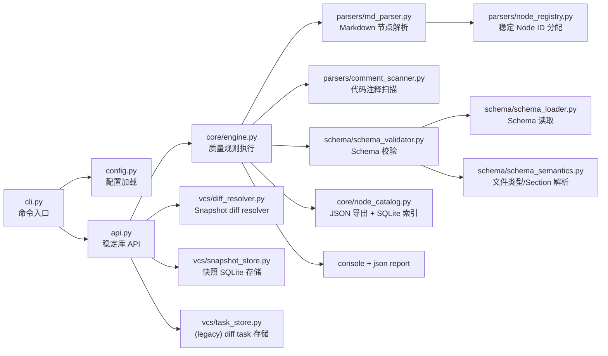
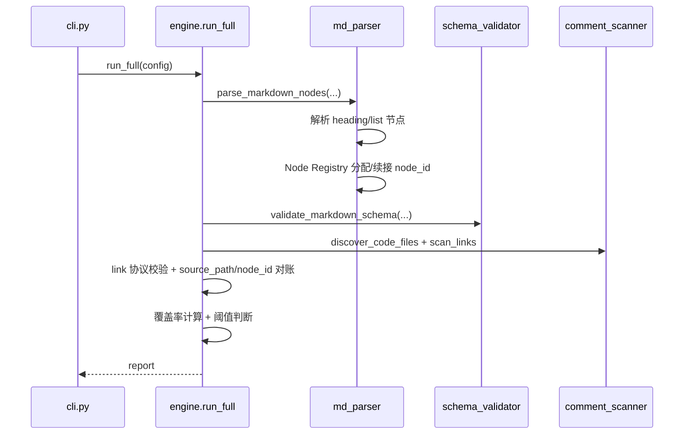
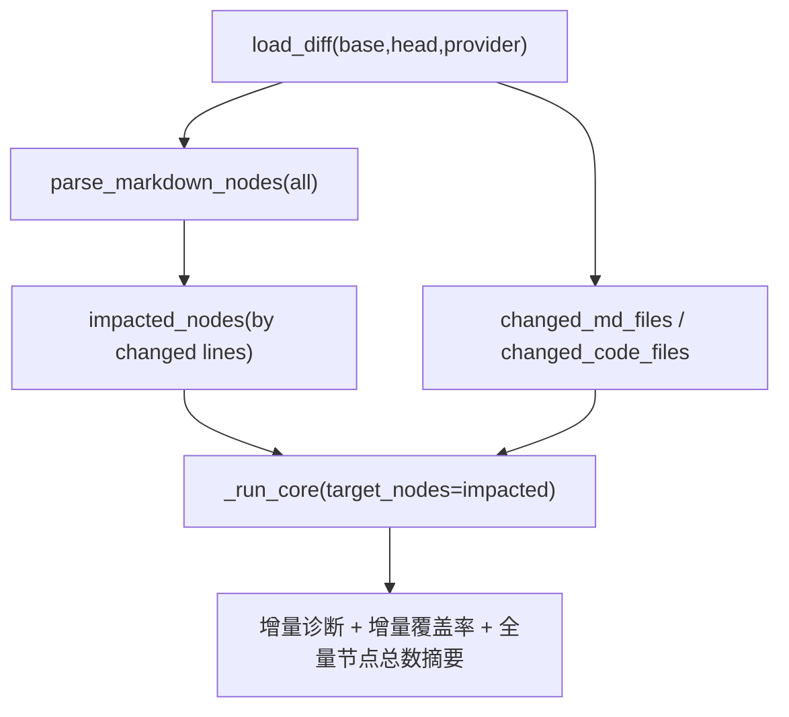
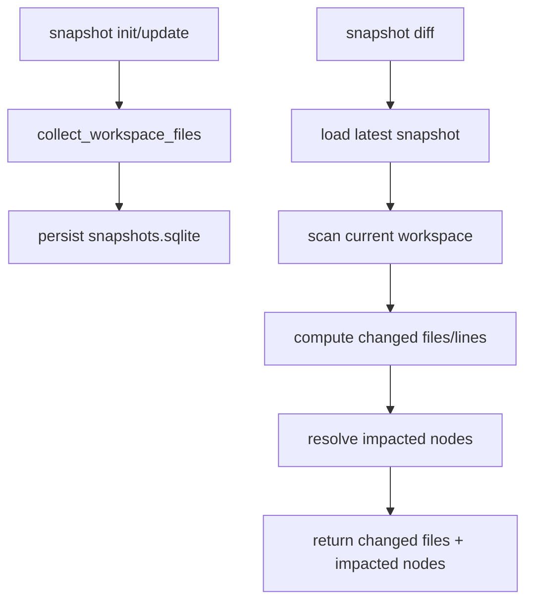
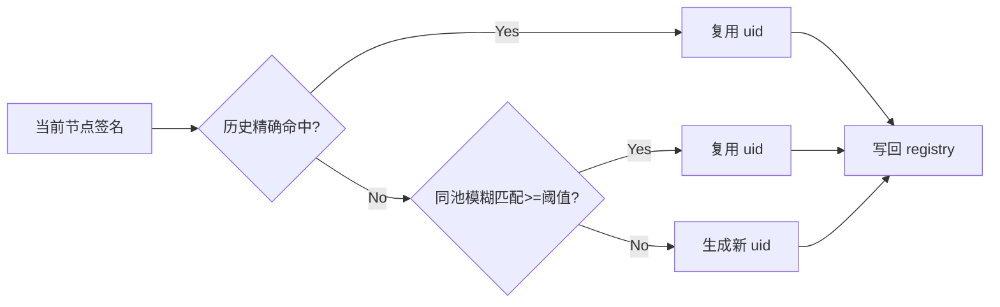

# iwp-lint 架构与工作机制说明

本文档面向后续维护者，说明 `iwp_lint` 的代码架构、核心数据流和关键设计决策。

## 1. 目标与边界

`iwp-lint` 的目标是把 IWP 文档与代码实现之间的映射关系做成可校验、可门禁、可回归的工程流程。

- 输入：
  - IWP Markdown（`InstructWare.iw/**/*.md`）
  - 代码注释映射（`@iwp.link <source_path>::<node_id>`）
  - 差异来源（filesystem snapshot）
- 输出：
  - 结构化诊断（`IWP10x` / `IWP20x`）
  - 覆盖率指标（`NodeLinked%`、`CriticalNodeLinked%`、`NodeTested%`）
  - 控制台报告与 JSON 报告

非目标：

- 不校验业务代码语义正确性
- 不做语言级 lint（类型、风格、格式化）
- 不承担完整构建编排（由 `iwp_build` 负责）

## 2. 模块总览



### 2.1 目录职责

- `cli.py`：命令行参数解析与输出渲染
- `api.py`：稳定库化入口（供 `iwp_build` 或其他 orchestrator 直接调用）
- `config.py`：配置模型与 `.yaml/.json` 加载
- `core/engine.py`：`full/diff/schema` 质量规则执行
- `parsers/md_parser.py`：Markdown 节点提取（heading/list）+ kind 计算
- `parsers/node_registry.py`：稳定 `node_id`（语义签名 + 历史映射）
- `parsers/comment_scanner.py`：代码注释扫描与协议正则校验
- `schema/*`：schema profile 读取、文件类型匹配、section 合法性校验
- `vcs/diff_resolver.py`：DiffProvider 抽象与受影响节点筛选
- `vcs/snapshot_store.py`：snapshot 基线（SQLite）与文件指纹比较
- `vcs/task_store.py`：diff task 状态机持久化（JSON 文件，legacy）
- `core/node_catalog.py`：`node_catalog.v1.json` 导出与 `node_index.v1.sqlite` 查询索引

## 3. 关键数据模型

### 3.1 `MarkdownNode`（`core/models.py`）

关键字段：

- `node_id`：节点稳定 ID（由 Node Registry 分配）
- `source_path`：相对 IWP 根路径（例如 `views/pages/home.md`）
- `line_start`/`line_end`：节点在原文中的行范围
- `section_key`、`file_type_id`、`computed_kind`：Schema 语义上下文
- `is_critical`：关键节点标记（由配置关键词匹配）

### 3.2 `LinkAnnotation`

从代码注释扫描得到，包含：

- `source_path`
- `node_id`
- `file_path`, `line`, `column`

### 3.3 覆盖身份键（NodeKey）

覆盖统计统一按 `(source_path, node_id)` 计算，避免不同文件中相同 `node_id` 产生误判。

### 3.4 SnapshotFile（`vcs/snapshot_store.py`）

- `path`：项目相对路径
- `kind`：`markdown` 或 `code`
- `mtime_ns` / `size` / `digest`：变更识别指纹
- `content`：仅 markdown 缓存（用于行级差异估算）

### 3.5 DiffTask（`vcs/task_store.py`, legacy）

- `task_id`
- `status`：`pending` -> `running` -> `done/failed`
- `changed_files` / `changed_md_files` / `changed_code_files`
- `impacted_nodes`

## 4. 三条执行路径

## 4.1 `full` 模式



特点：全量节点、全量代码扫描，适合作为主分支或夜间基线检查。

## 4.2 `diff` 模式



特点：

- 只对受影响节点进行覆盖门禁，降低 CI 成本
- 固定基于 filesystem snapshot 基线

## 4.3 `snapshot` 模式（API 内部能力）

`snapshot` 通过 `api.py` 提供给编排层（`iwp-build`）使用；不作为 `iwp-lint` 的用户命令入口。



特点：

- 无版本控制工具依赖
- 可在脏工作区工作
- 直接产出变更摘要供编排层消费

## 4.4 `schema` 模式

仅执行 markdown schema 校验，不执行链接覆盖率逻辑。

## 5. Node ID 稳定策略（重点）

早期实现使用结构序号，重排容易导致 ID 漂移。当前版本改为：

- 语义签名：`source_path + file_type_id + section_key + node_type + parent_chain + anchor_text`
- 文本归一化：Unicode NFKC + `casefold` + 去噪
- UID 分配策略：
  1. 精确签名命中（复用历史 uid）
  2. 同池模糊匹配（相似度阈值）
  3. 新建 uid（`n.<hex>`）

注册表文件（默认）：

- `.iwp/node_registry.v1.json`



维护建议：

- 团队协作场景建议将 registry 纳入版本控制
- 对 registry 冲突采用“以最新文档解析结果覆盖并重跑 full”策略

## 6. 诊断与退出码

## 6.1 典型错误码

- 链接协议与映射：`IWP101`~`IWP109`
- Schema 结构：`IWP201`~`IWP205`

## 6.2 退出码约定

- `0`：无 error（warning 不阻断）
- `1`：存在 error（门禁失败）
- `2`：运行时错误（例如 snapshot 基线缺失或配置错误）

## 7. Catalog 索引策略

`nodes build` 会同时产出：

- 人类/审计导出：`.iwp/node_catalog.v1.json`
- 查询索引：`.iwp/cache/node_index.v1.sqlite`

查询逻辑：

1. 优先读取 sqlite 索引
2. 索引不存在时回退 JSON

这样兼顾了可读导出与高效查询。

### 7.1 Agent 上下文 sidecar（`.iwc`）

`nodes compile` 会在 `.iwp/compiled/**` 生成按源 markdown 拆分的双产物，供 agent 与校验流程协同使用：

- 机器权威格式：`.iwp/compiled/json/**/*.iwc.json`
- agent 友好格式：`.iwp/compiled/md/**/*.iwc.md`

`.iwc.json`（canonical）包含：

- 文档级：`artifact=iwc`、`version=2`、`source_path`、`source_hash`、`generated_at`、`schema_version`
- 字典池：`dict.kinds`、`dict.titles`、`dict.sections`、`dict.file_types`
- 节点级：固定 10 列 tuple（`node_id`、`anchor_text`、`kind_idx`、`title_idx`、`section_idx`、`file_type_idx`、`is_critical`、`source_line_start`、`source_line_end`、`block_text`）
- `block_text` 为必需字段，用于给 agent 提供原始 markdown 片段锚点

`.iwc.md`（agent view）包含：

- 文档头部元信息注释：`@iwp.meta artifact=iwc_md`、`version=1`、`source_path`、`source_hash`、`schema_version`、`generated_at`、`entry_count`
- 节点注释：`<!-- @iwp.node id=<node_id> -->`（仅保留 `id`，避免注释噪音）
- 节点正文：保持原始 markdown 片段顺序，不在可见正文中混入 node id

`nodes verify-compiled` 用于校验双产物一致性：

- 缺失：源 markdown 存在但 `.iwc.json` 或 `.iwc.md` 缺失
- 过期：`source_hash` 与当前源文件不一致
- 非法：JSON/Markdown 结构异常，或 `.iwc.json` 与 `.iwc.md` 的 `entry_count`、节点顺序不一致

当 `verify-compiled` 发现上述问题时，CLI 返回非 0，用于 CI 门禁。

## 8. API 稳定入口

稳定入口在 `iwp_lint/api.py`，用于被 `iwp_build` 或第三方编排器复用：

- `snapshot_action(config, action)`
- `tasks_list/show/complete/mark_running/mark_failed`（legacy）
- `run_quality_gate(config)`

规则：

- 业务逻辑应优先落在 API/核心模块，不放在 CLI 渲染层
- API 返回结构需要保持向后兼容

## 9. 可扩展点

推荐按以下位置扩展：

- 新增注释协议：`parsers/comment_scanner.py`
- 新增 node 解析规则：`parsers/md_parser.py`
- 新增 schema 约束：`schema/schema_validator.py`
- 新增 coverage 口径：`core/engine.py` 与 `core/models.py`
- 新增 diff provider：`vcs/diff_resolver.py`
- 新增 snapshot/task 存储策略：`vcs/snapshot_store.py` / `vcs/task_store.py`

原则：

- 先扩展数据模型，再扩展校验流程，最后补测试
- CLI 只做参数与输出，核心逻辑放 API
- 对外报告字段尽量向后兼容

## 10. 维护检查清单

每次改动建议至少执行：

```bash
python -m unittest iwp_lint.tests.test_regression
python -m iwp_lint schema --config .iwp-lint.yaml
python -m iwp_lint full --config .iwp-lint.yaml
```

如果修改了 diff、snapshot 或 node_id 逻辑，额外建议：

- 构造“重排列表”“文案微调”“跨语言文档”场景做回归
- 检查 `.iwp/node_registry.v1.json` 是否符合预期演化
- 检查 `.iwp/cache/snapshots.sqlite` 与 `.iwp/tasks/` 产物是否符合预期

